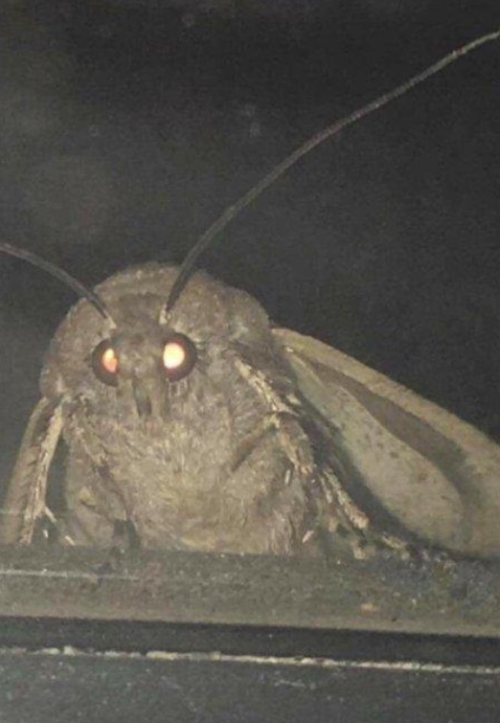

# Moths around light

<div id="top"></div
<div align="center">



  <h3 align="center">This is exactly what it sounds like.</h3>

  <p align="center">
     Moths fly around a light bulb (with post processing effects applied) by using an artificial life program called "boids".
  </p>
</div>


using:

- three drei
- three fiber
- leva (debugging)
- three-stdlib

## Installation
```
npm install

npm run dev
```

## Resources + models

- [bulb](https://sketchfab.com/3d-models/light-bulb-553f292157bf40f99dfb20979bf14d5f) 
- [moth](https://sketchfab.com/3d-models/narrow-bordered-bee-hawk-moth-6e2236d57f2942edb8e895b1aa13201c) 
- [about boids](https://en.wikipedia.org/wiki/Boids)